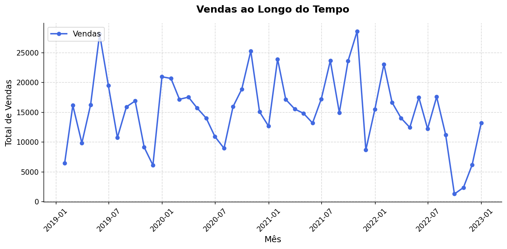

# Projeto Varejo - Análise Exploratória de Dados (AED)

Projeto que desenvolve uma análise exploratória de dados de registros reais de compras do varejo.

---

## Objetivo

Preparar uma base para análises mais avançadas ou para alimentar um dashboard. Identificar problemas nos dados, tratar esses problemas com ferramentas adequadas e gerar estatísticas e funções de agrupamento para responder perguntas operacionais como:

- Quem compra mais?
- Quais categorias vendem mais?
- Como variam as vendas ao longo do tempo?

---

## Base de Dados

- **Fonte:** base_varejo.csv — Informações de Vendas do Varejo

**Diagnóstico inicial:**

| Métrica | Valor |
|---------|-------|
| Registros/Linhas | 830.000 |
| Colunas | 14 |
| Duplicatas | 96.553 |
| Nulos | 3.320.000 |

**Observações:**
- 4 colunas estão sem nenhum dado → serão removidas pois não trazem nenhuma contribuição à análise
- Existem dados duplicados → serão excluídos, mantendo o registro mais recente
- A coluna data apresenta tipo de dado incompativel → será convertida
- Foram encontradas categorias vazias em PR_CAT → serão substituidas por 'Sem Categoria'

**Verificação dos tipos de dados:**

| Coluna | Tipo Atual | Status |
|--------|-----------|--------|
| DATA | str | → Converter para datetime |
| CO_ID | int64 | ✅ OK |
| CL_ID | int64 | ✅ OK |
| CL_GENERO | str | ✅ OK |
| CL_EC | int64 | ✅ OK |
| CL_FHL | int64 | ✅ OK |
| CL_SEG | str | ✅ OK |
| PR_ID | int64 | ✅ OK |
| PR_CAT | str | ✅ OK |
| PR_NOME | str | ✅ OK |

---

## Tratamento dos Dados

- 4 colunas vazias removidas
- Verificação de categorias vazias em PR_CAT: foram encontrados 3.228 registros com valor '#N/D', substituídos por 'Sem Categoria'
- Duplicatas removidas mantendo o primeiro registro
- Os dados da coluna CO_ID estão válidos e foram mantidos, já que uma compra pode ter vários produtos, o que acaba repetindo o ID em algumas linhas
- Coluna DATA convertida de str para datetime

**Base após limpeza:**

| Métrica | Valor |
|---------|-------|
| Registros/Linhas | 733.447 |
| Colunas | 10 |
| Duplicatas | 0 |
| Nulos | 0 |

---

## Estatística Descritiva

Aplicação das funções estatísticas para coletar parâmetros da coluna de Número de filhos do cliente.

**Análises**

Estatísticas mais relevantes:

| Estatística | Valor | Análise |
|-------------|-------|---------|
| mean | 1.15 | Média de 1 filho por cliente|
| std | 1.42 | A variação entre o numero de filhos dos clientes é grande|
| moda | 0 | Mais da metade dos clientes não tem fihos |
| 75% | 2 | 75% dos clientes tem até 2 filhos |
| max | 4 | Os clientes com mais filhos tem 4 |

---

## Padrões de Agrupamento

Explorar padrões de agrupamento com combinações para entender comportamento de compra dos clientes e insights.

**Agrupamentos**

* Compras por gênero:

| Genero | Compras |
|--------|---------|
| Feminino | 382.427 |
| Masculino | 351.020 |

* Vendas por categoria:

| Categoria | Compras |
|-----------|---------|
| Alimentos	| 384197 |
| Higiene | 137702 |
| Limpeza | 128632 |
| Bebidas | 38264 |
| Pet | 28553 |
| Acessórios | 12871 |
| Sem Categoria | 3228 |

* Top 3 Produtos mais vendidos:

| Posição | Produto | Vendas |
|---------|---------|--------|
| 1º | Presunto Cozido |12.719 |
| 2º | Sardinha | 6.610 |
| 3º | Banana | 6.518 |

* Vendas por categoria de acordo com o gênero:

| Categoria | Feminino | Masculino |
|-----------|----------|-----------|
| Alimentos | 200.274 | 183.923 |
| Higiene | 71.721 | 65.981 |
| Limpeza | 67.328 | 61.304 |
| Bebidas | 19.764 | 18.500 |
| Pet | 14.809 | 13.744 |
| Acessórios | 6.839 | 6.032 |
| Sem Categoria | 1.692 | 1.536 |

* Vendas por categoria de acordo com a condição "TEM FILHOS":

| Condição | Total de Vendas |
|----------|-----------------|
| Sem filhos | 384.986 |
| Com filhos | 348.461 |

| Categoria | Com Filhos | Sem Filhos |
|-----------|-----------|-----------|
| Alimentos | 182.527 | 201.670 |
| Higiene | 65.400 | 72.302 |
| Limpeza | 61.007 | 67.625 |
| Bebidas | 18.273 | 19.991 |
| Pet | 13.593 | 14.960 |
| Acessórios | 6.116 | 6.755 |
| Sem Categoria | 1.545 | 1.683 |

## CGráfico de Vendas ao Longo do Tempo

## Conclusões

**Insights**

1 - Não existe uma diferença tão relevante de consumo entre gêneros, sendo 52,1% do total d compras de mulheres e 47,9% compras de homens. Porém as mulheres lideram com consistência e todas as categorias.

2 - Alimentos lideram com folga no quesito categoria, com mais da metade do total de vendas (52,4%). 

3 - Os hábitos de consumo com relação ao gênero, levando em conta as categorias dos produtos, são muito parecidos. Não trazem uma diferença relevante entre homens e mulheres.

4 - O consumo do grupo de pessoas com filho é maior em todas as categorias, entretanto o número de clientes sem filho é maior, o que torna a quantidade proporcional de compras praticamente igual entre os dois perfis.

5 - As categorias de Acessórios e Pet, estão com um volume baixo em relação à quantidade total de compras, pode indicar nichos a serem trabalhados para aumentar as vendas.

6 - De acordo com o gráfico 'Vendas ao Longo do Tempo', é possivel observar um padrão de sazonalidade ao longo do tempo, com queda nas vendas no final e no meio do ano e subida logo após essa época.